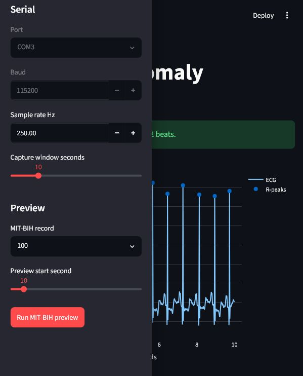

# ESP32 ECG Anomaly Detector

ESP32 + AD8232 heartbeat anomaly detector with a MIT-BIH-trained ML model and Streamlit dashboard.

The ESP32 streams ECG samples from an AD8232 sensor to a PC over UART. The Python dashboard filters the ECG, detects R-peaks, calculates BPM, extracts beat windows, and classifies beats into:

- `N`: normal and bundle branch beats
- `S`: supraventricular ectopic beats
- `V`: ventricular ectopic beats
- `F`: fusion beats
- `Q`: unknown, paced, or unclassifiable beats

> This is an educational prototype, not a medical device.

## Preview



## Hardware

- ESP32 development board
- AD8232 ECG module
- Three electrodes: `RA`, `LA`, `RL`
- USB cable
- PC for training and dashboard

## Wiring

| AD8232 pin | ESP32 pin |
| --- | --- |
| `OUTPUT` | `GPIO34` |
| `LO+` | `GPIO26` |
| `LO-` | `GPIO27` |
| `3.3V` | `3V3` |
| `GND` | `GND` |

Electrodes:

- `RA`: right wrist
- `LA`: left wrist
- `RL`: right ankle

## Quick Start

### 1. Flash ESP32

Open this sketch in Arduino IDE:

```text
firmware/esp32_ad8232_stream/esp32_ad8232_stream.ino
```

Use board `ESP32 Dev Module` and baud `115200`.

### 2. Install Python Dependencies

```powershell
cd "C:\Users\Trijal\Documents\IOT Project\pc_app"
python -m venv .venv
.\.venv\Scripts\Activate.ps1
pip install -r requirements.txt
```

TensorFlow may require Python 3.11 or 3.12 on Windows.

### 3. Train Model

```powershell
python src\train_mitbih.py
```

This downloads MIT-BIH, trains the CNN, and saves model files under `pc_app/models`.

### 4. Run Dashboard

```powershell
streamlit run src\dashboard.py
```

Open:

```text
http://localhost:8501
```

Dashboard modes:

- `MIT-BIH preview sample`: test without hardware
- `Live ESP32 serial`: classify ECG from the ESP32 COM port

## Project Structure

```text
firmware/
  esp32_ad8232_stream/
    esp32_ad8232_stream.ino
pc_app/
  requirements.txt
  src/
    dashboard.py
    mitbih_labels.py
    model.py
    preprocess.py
    serial_ecg.py
    train_mitbih.py
  data/
  models/
GUIDE.md
```

## Documentation

For the full explanation of wiring, firmware, ML training, preprocessing, dashboard flow, file-by-file code behavior, troubleshooting, and safety notes, read:

[GUIDE.md](GUIDE.md)

## Notes

- The model classifies ECG beat windows, not BPM alone.
- `Overall class` in the dashboard uses majority voting across detected beats.
- `Latest class` shows only the most recent detected beat.
- Close Arduino Serial Monitor before using the dashboard, because only one program can use the ESP32 COM port at a time.

